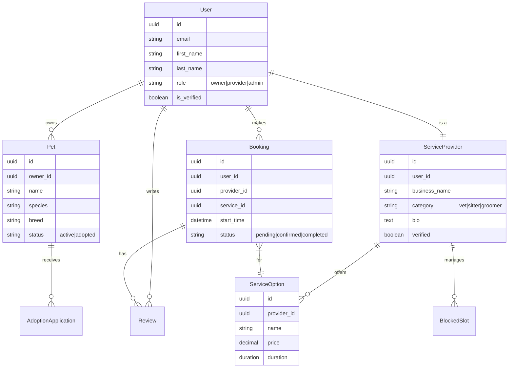

# Database Schema

## Entity Relationship Diagram (ERD)

## Core Models

### 1. Users (`apps.users`)
- **User**: Custom user model extending AbstractUser. Handles auth and basic profile data.
- **RoleRequest**: Stores requests for users upgrading to 'Provider' status.

### 2. Services (`apps.services`)
- **ServiceProvider**: Profile for vets, sitters, etc. Linked 1-to-1 with User.
- **ServiceOption**: Specific services offered by a provider (e.g., "Dog Walking - 30m").
- **Booking**: Central record of service appointments.
- **Review**: Ratings and feedback for completed bookings.

### 3. Pets & Rehoming (`apps.pets`, `apps.rehoming`)
- **Pet**: Profile of a pet. Can be owned by a user or listed for adoption.
- **AdoptionApplication**: Request from a user to adopt a specific pet.

### 4. Admin (`apps.admin_panel`)
- **UserReport**: Reports filed against users or content for admin review.
