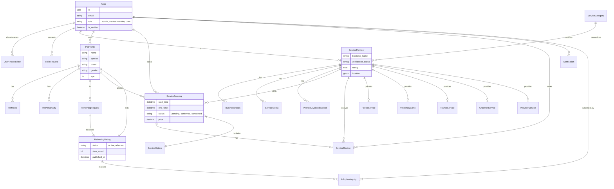

# Database Schema & Architecture

## Overview
PetCarePlus uses a normalized relational database (PostgreSQL) designed for data integrity and scalability. The schema is divided into modular applications: `users`, `pets`, `services`, `rehoming`, and `notifications`.

## Entity Relationship Diagram (ERD)

---

## Module Details

### 1. Users & Authentication (`apps.users`)
| Model | Description | Key Fields |
| :--- | :--- | :--- |
| **User** | Custom User model extending `AbstractBaseUser`. Handles Auth, Profile & Location. | `email`, `role`, `is_verified`, `latitude`, `longitude` |
| **RoleRequest** | Implementation of role upgrades (e.g. User -> ServiceProvider). | `requested_role`, `status`, `admin_notes` |
| **UserTrustReview** | P2P reviews between users to build community trust. | `reviewer`, `reviewee`, `rating` |

### 2. Pet Management (`apps.pets`)
| Model | Description | Key Fields |
| :--- | :--- | :--- |
| **PetProfile** | The canonical source of truth for a pet. | `owner`, `species`, `breed`, `health_info` |
| **PetMedia** | Photos and videos linked to a pet profile. | `url`, `is_primary` |
| **PersonalityTrait** | Dictionary of traits (e.g., "Energetic", "Shy"). | `name` |

### 3. Service Marketplace (`apps.services`)

#### Core Models
| Model | Description | Key Fields |
| :--- | :--- | :--- |
| **ServiceProvider** | Extension of the User model for business entities. | `business_name`, `verification_docs`, `service_radius` |
| **ServiceBooking** | Central booking record for all service types. | `start_time`, `end_time`, `status`, `payment_status` |
| **ServiceReview** | Detailed feedback mechanism for completed bookings. | `rating_overall`, `rating_quality`, `rating_cleanliness` |
| **BusinessHours** | Structured operating hours for providers. | `day`, `open_time`, `close_time` |
| **ProviderAvailabilityBlock** | Exception handling for provider availability (holidays, breaks). | `date`, `start_time`, `end_time` |

#### Specific Service Implementations (One-to-One with Provider)
- **VeterinaryClinic**: Adds `accreditations`, `emergency_services`, `specialties`.
- **PetSitterService**: Adds `rates`, `housing_conditions`, `accepted_sizes`.
- **TrainerService**: Adds `methodology` (e.g. Positive Reinforcement), `certifications`.
- **GroomerService**: Adds `salon_type` (Mobile/Shop), `equipment_list`.
- **FosterService**: Adds `capacity`, `foster_history`, `home_inspection_status`.

### 4. Rehoming (`apps.rehoming`)
| Model | Description | Key Fields |
| :--- | :--- | :--- |
| **RehomingRequest** | Initial submission by owner. Tracks draft status and cooling-off period. | `status`, `urgency`, `reason` |
| **RehomingListing** | The public-facing advertisement derived from a confirmed Request. | `view_count`, `published_at`, `status` |
| **AdoptionInquiry** | Applications submitted by potential adopters for a listing. | `status`, `match_score` (AI), `message` |

### 5. Notifications (`apps.notifications`)
| Model | Description | Key Fields |
| :--- | :--- | :--- |
| **Notification** | Central notification store for In-App, Email, and Push alerts. Uses Generic Relations (GFK) to link to any object (Booking, Inquiry, etc.). | `recipient`, `verb`, `target_content_type`, `is_read` |

---

## Design Decisions

### 1. Separation of Concerns (User vs. Provider)
We separate `User` (Identity) from `ServiceProvider` (Business Profile). This allows a single user to act as both a pet owner (booking services) and a service provider (offering services) without account switching.

### 2. Generic Booking System
Instead of separate tables for `VetAppointment`, `SitterBooking`, etc., we use a unified `ServiceBooking` model. Service-specific data is handled via JSON fields or specific foreign keys where strictly necessary. This simplifies the calendar and payment logic significantly.

### 3. Flexible "Service Details"
Using One-to-One relationships for service subclasses (`Vet`, `Sitter`) allows strict schema validation where it matters (e.g., License Numbers for Vets) while keeping the core `ServiceProvider` queryable for general searches.
