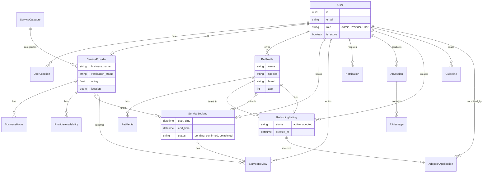

[⬅️ Back to Main README](https://github.com/rockychowdhury/PetCarePlus-Django-React)

# Database Schema & Architecture (V2)

## Overview
PetCarePlus V2 uses a normalized relational database (PostgreSQL) designed for data integrity, geospatial location tracking, and scalability. The schema is divided into modular Django applications: `accounts`, `animals`, `providers`, `bookings`, `reviews`, `ai_assistant`, `rehoming`, `notifications`, `locations`, and `resources`.

## Entity Relationship Diagram (ERD)

```mermaid
erDiagram
    %% ACCOUNTS APP
    User ||--o{ UserLocation : "has"
    User ||--o| ServiceProvider : "is"
    User ||--o{ PetProfile : "owns"
    User ||--o{ ServiceBooking : "books"
    User ||--o{ ServiceReview : "writes"
    User ||--o{ Notification : "receives"
    User ||--o{ AISession : "conducts"

    %% ANIMALS APP
    PetProfile ||--o{ PetMedia : "has"
    PetProfile ||--o{ RehomingListing : "listed_in"
    PetProfile ||--o{ ServiceBooking : "attends"

    %% PROVIDERS APP
    ServiceProvider ||--o{ BusinessHours : "has"
    ServiceProvider ||--o{ ProviderAvailability : "has"
    ServiceProvider ||--o{ ServiceBooking : "fulfills"
    ServiceProvider ||--o{ ServiceReview : "receives"
    ServiceCategory ||--o{ ServiceProvider : "categorizes"

    %% BOOKINGS & REVIEWS APP
    ServiceBooking ||--o| ServiceReview : "has"

    %% REHOMING APP
    User ||--o{ RehomingListing : "creates"
    RehomingListing ||--|| PetProfile : "lists"
    RehomingListing ||--o{ AdoptionApplication : "receives"
    AdoptionApplication }|--|| User : "submitted_by"

    %% AI ASSISTANT APP
    AISession ||--o{ AIMessage : "contains"
    
    %% RESOURCES APP
    User ||--o{ Guideline : "reads"

    %% ENTITY DEFINITIONS
    User {
        uuid id
        string email
        string role "Admin, Provider, User"
        boolean is_active
    }

    PetProfile {
        string name
        string species
        string breed
        int age
    }

    ServiceProvider {
        string business_name
        string verification_status
        float rating
        geom location
    }

    ServiceBooking {
        datetime start_time
        datetime end_time
        string status "pending, confirmed, completed"
    }

    RehomingListing {
        string status "active, adopted"
        datetime created_at
    }
```

---

## Module Details

### 1. Accounts & Identity (`apps.accounts`)
| Model | Description | Key Fields |
| :--- | :--- | :--- |
| **User** | Custom User model extending `AbstractBaseUser`. Uses JWT for auth. | `email`, `role`, `is_active`, `is_staff` |

### 2. Animals (`apps.animals`)
| Model | Description | Key Fields |
| :--- | :--- | :--- |
| **PetProfile** | The canonical source of truth for an animal (pet/livestock). | `owner`, `species`, `breed`, `age` |
| **PetMedia** | Photos and videos linked to a pet profile. | `image`, `is_primary` |

### 3. Service Providers (`apps.providers`)
| Model | Description | Key Fields |
| :--- | :--- | :--- |
| **ServiceProvider** | Business profile linked to a User. | `user`, `business_name`, `bio`, `service_radius` |
| **ServiceCategory** | Categories like "Veterinarian", "Groomer", "Shelter". | `name`, `icon` |
| **BusinessHours** | Standard weekly operating hours. | `provider`, `day_of_week`, `open_time`, `close_time` |

### 4. Bookings & Appointments (`apps.bookings`)
| Model | Description | Key Fields |
| :--- | :--- | :--- |
| **ServiceBooking** | Central booking record between User and Provider. | `user`, `provider`, `pet`, `start_time`, `status` |

### 5. Reviews (`apps.reviews`)
| Model | Description | Key Fields |
| :--- | :--- | :--- |
| **ServiceReview** | Feedback left by a user for a provider after a booking. | `booking`, `reviewer`, `provider`, `rating`, `comment` |

### 6. AI Assistant (`apps.ai_assistant`)
| Model | Description | Key Fields |
| :--- | :--- | :--- |
| **AISession** | A conversational thread with the GenAI diagnostic bot. | `user`, `pet`, `created_at` |
| **AIMessage** | Individual messages within a session (User or Bot). | `session`, `sender`, `content`, `timestamp` |

### 7. Rehoming (`apps.rehoming`)
| Model | Description | Key Fields |
| :--- | :--- | :--- |
| **RehomingListing** | Advertisement for pet adoption. | `owner`, `pet`, `reason`, `status` |
| **AdoptionApplication** | Application submitted by a potential adopter. | `listing`, `applicant`, `message`, `status` |

### 8. Locations (`apps.locations`)
| Model | Description | Key Fields |
| :--- | :--- | :--- |
| **Location** | Geospatial data for sorting providers by proximity (Haversine/PostGIS). | `entity_id`, `latitude`, `longitude` |

### 9. Resources (`apps.resources`)
| Model | Description | Key Fields |
| :--- | :--- | :--- |
| **Guideline** | Articles and care routines in English & Bengali. | `title_en`, `title_bn`, `content` |
| **GovtResource** | Links to government veterinary databases and laws. | `name`, `url`, `description` |
| **Vaccine** | Vaccination schedules based on species. | `species`, `vaccine_name`, `schedule_days` |

---

## Design Decisions (V2)

### 1. Unified User Model
Unlike V1 where providers and users were heavily fragmented, V2 uses a single `User` model. A user can *have* a `ServiceProvider` profile linked to their account, allowing seamless switching between acting as a pet owner and a business owner.

### 2. Deep Rehoming Integration
In V1, Rehoming was a standalone silo. In V2, `RehomingListing` uses the global `PetProfile` and `User` models. This means a user's pets can be seamlessly transitioned into a rehoming listing without duplicating data.

### 3. Geospatial Readiness
The `locations` app was abstracted to allow providers to be queried radially (e.g., "Find vets within 10km") using explicit latitude/longitude fields, speeding up API response times for location-based discovery.
